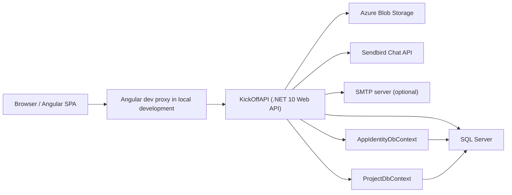
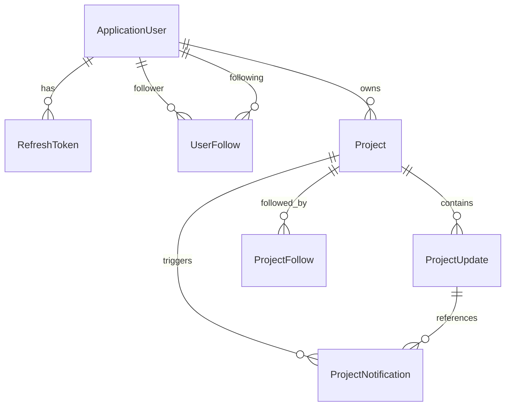

# KickOff Report Source Notes

Prepared: 2026-04-21

Purpose: This file is a source-backed documentation pack for the KickOff project. It is intended to be merged into a final formal report once the example/template document is provided.

## 1. Quick Facts

- Project name: `KickOff`
- Solution shape: two-part web application
- Backend: `KickOffAPI`, ASP.NET Core Web API on .NET 10
- Frontend: `KickOffClient`, Angular 21 single-page application
- Database: SQL Server via Entity Framework Core
- Auth model: ASP.NET Identity + JWT access token + refresh token cookie
- Storage integrations: Azure Blob Storage for images
- Messaging integration: Sendbird for direct chat
- Email integration: SMTP for confirmation, password reset, and project update emails
- Local frontend URL: `http://localhost:4200`
- Local backend URLs: `https://localhost:5001`, `http://localhost:5000`
- Main product theme: project discovery, profile networking, producer-led project publishing, creator updates, social following, and direct chat

## 2. Evidence Base

This summary was assembled from the actual code and configuration in the repository, especially:

- `README.md`
- `KickOffAPI/Program.cs`
- `KickOffAPI/Controllers/*.cs`
- `KickOffAPI/Services/*.cs`
- `KickOffAPI/Data/Contexts/*.cs`
- `KickOffAPI/Entities/**/*.cs`
- `KickOffAPI/DTOs/*.cs`
- `KickOffAPI/Data/Seeders/*.cs`
- `KickOffAPI/appsettings*.json`
- `KickOffClient/src/app/app.routes.ts`
- `KickOffClient/src/app/components/**/*.ts`
- `KickOffClient/src/auth/**/*.ts`
- `KickOffClient/package.json`
- `KickOffClient/angular.json`

## 3. Project Overview

KickOff is a full-stack platform for discovering projects, publishing producer-led initiatives, following people and projects, posting creator updates, and opening direct conversations between users. The current implementation combines social/networking concepts with lightweight crowdfunding-style project presentation. Some crowdfunding-adjacent concepts exist in the data model, but not every marketplace or payment workflow is fully implemented yet.

At a product level, KickOff currently supports:

- account registration, login, logout, password reset, email confirmation, email change, password change, deactivation, and deletion
- public project browsing with filtering, paging, and search
- public project detail pages with updates, contacts, media, and recommendations
- project creation and editing for users with `Producer` or `Admin` role
- user profiles, follower/following relationships, and discoverable creators
- project following with in-app and optional email notification preferences
- creator update publishing for project owners
- direct chat via Sendbird, including preferred-language translation support
- account settings for profile, auth, role upgrade, and chat preferences

## 4. High-Level Architecture

### Architectural Observations

- The system is split cleanly into frontend and backend projects.
- Local frontend-to-backend communication assumes proxying `/api` requests from Angular to `https://localhost:5001`.
- The backend uses two EF Core contexts against the same SQL Server database:
  - `AppIdentityDbContext` for identity data
  - `ProjectDbContext` for project-domain data
- The backend startup process applies pending migrations automatically in development.
- The chat layer is deliberately externalized to Sendbird instead of being implemented as a custom real-time backend.
- Images are not stored in SQL Server; instead, the application stores blob names/URLs and resolves them through Azure Blob Storage.

## 5. Repository Structure

### Root Level

- `KickOffAPI/` backend source and EF migrations
- `KickOffClient/` Angular frontend source
- `README.md` environment setup and handoff instructions

### Backend Structure

- Controllers: 5
- Services: 11
- Entity classes: 7
- DTO classes: 23

Key backend folders:

- `Controllers/`
- `Data/Contexts/`
- `Data/Identity/Migrations/`
- `Data/Projects/Migrations/`
- `Data/Seeders/`
- `Entities/`
- `Repositories/`
- `Services/`
- `Specifications/`

### Frontend Structure

- Page-level sheet components: 9
- Shared UI component folders: 8
- Auth page components: 5
- Frontend unit test files: 30

Key frontend areas:

- `src/app/components/sheets/` major screens
- `src/app/components/shared/` shared UI and utility components
- `src/app/services/` project, filter, settings, and Sendbird services
- `src/auth/` auth pages, auth services, guards, interceptor, and auth state

## 6. Technology Stack

### Backend

- .NET SDK: verified in README as `10.0.202`
- ASP.NET Core Web API
- Entity Framework Core 10 with SQL Server
- ASP.NET Identity
- JWT Bearer authentication
- OpenAPI generation in development
- Azure Blob Storage SDK
- SMTP via `System.Net.Mail`

### Frontend

- Angular 21
- TypeScript 5.9
- Angular Material
- PrimeNG and PrimeIcons
- RxJS
- Sendbird Chat SDK 4.x
- Vitest-based Angular unit testing

### External Dependencies

- SQL Server
- Azure Blob Storage
- Sendbird
- SMTP server, optional but used for full email workflows

## 7. Configuration and Environment

The backend expects configuration from `appsettings.json`, optional local JSON overrides, environment variables, or user secrets.

### Required Configuration Groups

- `ConnectionStrings:AppDb`
- `Jwt:Key`
- `Jwt:Issuer`
- `Jwt:Audience`
- `Jwt:ExpiresMinutes`
- `AzureBlob:ConnectionString`
- `AzureBlob:ContainerName`
- `Sendbird:AppId`
- `Sendbird:ApiToken`

### Important Optional or Environment-Sensitive Groups

- `Smtp:*`
- `Auth:ClientBaseUrl`
- `ProjectNotifications:ClientBaseUrl`
- `DevelopmentSeed:*`

### Environment Behavior

- `appsettings.Local.json` is loaded if present.
- `appsettings.{Environment}.Local.json` is also supported.
- In development, the API exposes OpenAPI, applies migrations automatically, and seeds roles/users/projects.
- If client base URLs are not configured and the backend is in development, `ClientAppUrlResolver` falls back to `http://localhost:4200`.

### Important Deployment Note

I did not find any explicit CORS configuration in `Program.cs`. The local development story depends on the Angular proxy, which works well in development but should be documented carefully for production deployment planning.

## 8. Domain Model

### Core Identity Concepts

`ApplicationUser` extends ASP.NET Identity with:

- `PublicId` as a public-facing GUID
- `State` as a user-state enum
- `ProfilePictureUrl`
- `PreferredChatLanguage`
- `ShowOriginalChatTextByDefault`
- collections for followers, following, and refresh tokens

Important design choice:

- internal identity uses the standard ASP.NET Identity string `Id`
- public-facing URLs and chat identities use `PublicId`

This is a strong architectural decision because it prevents direct exposure of the internal identity key in public URLs and Sendbird user IDs.

### Project Concepts

`Project` includes:

- `Id`
- `Headline`
- `Goal`
- `Description`
- `Category`
- `Problem`
- `ExtraInfo`
- `FinancialGoal`
- `FinancialRaised`
- `State`
- `OwnerId`
- `SettingsId`
- `EndsAt`
- `CreatedAt`
- `UpdatedAt`

It also stores several collections as JSON columns:

- `ImageUrls`
- `Tags`
- `CollaboratorsIdP`
- `Contacts`
- `BackerIds`

This design keeps the schema compact, but it also means some queries become less relational and more application-side, especially the backed-project lookup.

### Project Update Concepts

`ProjectUpdate` supports:

- update title
- update content
- author tracking
- create/edit timestamps

These updates are central to the notification system because publishing an update creates in-app notifications and optional email notifications for followers.

### Social Concepts

- `UserFollow` models person-to-person follows
- `ProjectFollow` models user-to-project follows plus notification preferences
- `ProjectNotification` stores in-app notification records for project updates

### Enumerations

Project state values:

- `Proposed`
- `Cancelled`
- `Active`
- `Inactive`
- `OnHold`
- `Completed`

User state values:

- `Online`
- `Offline`
- `Busy`
- `Away`
- `Unknown`

Important nuance:

- I found the `UserState` enum and DTO exposure for it, but I did not find server-side lifecycle logic that actively updates that value during normal application use. It should be described as a modeled property, not as a fully demonstrated presence engine.

## 9. Data Architecture

### DbContexts

`AppIdentityDbContext` contains:

- `Users`
- `Roles`
- `UserRoles`
- `RefreshTokens`
- `UserFollows`

`ProjectDbContext` contains:

- `Projects`
- `ProjectUpdates`
- `ProjectFollows`
- `ProjectNotifications`

### Schema Design Notes

- the two contexts share one SQL Server database
- each context uses its own migrations history table
- user follow relationships use composite keys
- project follow relationships use composite keys
- project notifications index recipient, read state, and created time for efficient inbox queries
- project updates are ordered by created time descending in read paths

## 10. Backend Startup and Service Registration

The backend startup routine in `Program.cs` performs these major responsibilities:

- loads configuration, including optional local JSON files
- validates required DB and JWT settings
- registers both EF Core contexts
- configures ASP.NET Identity
- configures JWT bearer authentication
- validates the user on token use and rejects locked/deleted accounts
- binds option models for Sendbird, auth URLs, SMTP, and project notification URLs
- registers repositories and application services
- enables OpenAPI in development
- migrates databases in development
- creates roles if missing
- seeds users, follow relationships, and projects in development

### Registered Roles

- `Admin`
- `Producer`
- `Backer`
- `User`
- `Guest`

## 11. Authentication and Session Design

KickOff uses a mixed token model:

- short-lived JWT access token returned in API responses
- long-lived refresh token stored as an HttpOnly cookie

### Session Flow

1. login validates credentials
2. API returns `accessToken`
3. API also issues a refresh-token cookie
4. frontend stores `accessToken` in `localStorage`
5. frontend interceptor retries `401` responses by calling `/api/auth/refresh`
6. refresh rotates the refresh token and returns a new access token

### Security-Relevant Details

- JWT issuer, audience, lifetime, and signing key are validated
- refresh tokens are revocable and rotated
- logout revokes the matching refresh token when possible
- deactivation revokes active refresh tokens and clears the cookie
- password reset revokes active refresh tokens
- cookie settings use `HttpOnly`, `SameSite=Strict`, and `Secure` outside development

### Important Product Note

Email verification exists, but it is not currently required for login. Evidence:

- `options.SignIn.RequireConfirmedEmail = false`
- registration returns `requiresEmailConfirmation = false`

This should be described honestly in the final report. Verification improves account integrity and recovery, but it is not enforced as a sign-in gate in the current implementation.

## 12. Backend API Surface

Approximate public API surface identified in controllers: about 45 endpoints.

### Auth API

| Method | Route | Purpose |
| --- | --- | --- |
| POST | `/api/auth/register` | Create account and provision Sendbird user |
| POST | `/api/auth/login` | Login by email or username |
| GET | `/api/auth/confirm-email` | Confirm email via tokenized link |
| POST | `/api/auth/resend-confirmation` | Resend email confirmation |
| POST | `/api/auth/forgot-password` | Request reset instructions |
| POST | `/api/auth/reset-password` | Complete password reset |
| POST | `/api/auth/change-password` | Authenticated password change |
| POST | `/api/auth/change-email` | Authenticated email change |
| POST | `/api/auth/deactivate-account` | Lock and sign out account |
| POST | `/api/auth/delete-account` | Permanently delete eligible account |
| POST | `/api/auth/refresh` | Rotate refresh token and mint new access token |
| POST | `/api/auth/logout` | Revoke refresh token and clear cookie |
| GET | `/api/auth/me` | Return current user profile |

### Project API

| Method | Route | Purpose |
| --- | --- | --- |
| POST | `/api/project` | Create project from multipart form data |
| PUT | `/api/project/{id}` | Update project from multipart form data |
| GET | `/api/project/{id}` | Get full project detail |
| POST | `/api/project/{id}/follow` | Follow project |
| DELETE | `/api/project/{id}/follow` | Unfollow project |
| PUT | `/api/project/{id}/follow/preferences` | Update project alert preferences |
| GET | `/api/project/{id}/updates` | Get project updates |
| POST | `/api/project/{id}/updates` | Publish project update |
| PUT | `/api/project/{id}/updates/{updateId}` | Edit project update |
| DELETE | `/api/project/{id}/updates/{updateId}` | Delete project update |
| GET | `/api/project/notifications` | Get project notification inbox |
| POST | `/api/project/notifications/{notificationId}/read` | Mark one alert as read |
| POST | `/api/project/notifications/read-all` | Mark all alerts as read |
| GET | `/api/project/projects` | Read project catalogue |
| GET | `/api/project/projects/state/{state}` | Read state-specific catalogue |
| GET | `/api/project/search` | Search with filters, sort, and paging |
| GET | `/api/project/search-by-goal` | Goal keyword search |
| GET | `/api/project/paginated` | Generic paginated listing |
| POST | `/api/project/cache/clear` | Clear project cache version |

### User API

| Method | Route | Purpose |
| --- | --- | --- |
| GET | `/api/users/get-discover` | Return discoverable creators |
| GET | `/api/users/{publicId}` | Get user profile by public GUID |
| GET | `/api/users/get-profile?id={guid}` | Alternate profile route |
| PUT | `/api/users/profile` | Update username/profile basics |
| POST | `/api/users/profile-picture` | Upload avatar image |
| POST | `/api/users/{publicId}/follow` | Follow another user |
| DELETE | `/api/users/{publicId}/follow` | Unfollow another user |
| POST | `/api/users/become-producer` | Self-upgrade into producer role |
| PUT | `/api/users/chat-preferences` | Update preferred chat language/display mode |

### Chat API

| Method | Route | Purpose |
| --- | --- | --- |
| GET | `/api/chat/token` | Mint Sendbird session token |
| POST | `/api/chat/channel` | Create or reuse distinct direct channel |
| GET | `/api/chat/channels` | Read current user channels |

### Health / Root API

| Method | Route | Purpose |
| --- | --- | --- |
| GET | `/api/home` | Simple API connectivity check |

## 13. Core Backend Services

### `ProjectService`

Responsibilities:

- create and edit projects
- enforce creator roles (`Producer` or `Admin`)
- load projects and normalize DTOs
- handle image upload cleanup on failed operations
- create, edit, and delete project updates
- drive project search, filtering, and pagination
- generate DTOs with owner names and blob SAS URLs

Important business rules:

- only producers and admins can create projects
- only project owner or admin can edit project or updates
- a project can have at most 6 images
- project update titles/content have min and max lengths

### `ProjectFollowService`

Responsibilities:

- follow and unfollow projects
- prevent following your own project
- store follow preferences for in-app and email alerts

### `ProjectNotificationService`

Responsibilities:

- create in-app notifications when project updates are published
- optionally send matching email notifications
- return unread counts and recent notification feeds
- mark one or all notifications as read

### `UserService`

Responsibilities:

- load user profiles with related projects and connections
- upgrade users to producer role
- update username
- update chat preferences
- determine account deletion eligibility
- delete accounts and dependent data safely
- produce discoverable producer suggestions

Important deletion rule:

- permanent deletion is blocked if the account still owns projects
- permanent deletion is also blocked if the account has published project updates

### `SendbirdService`

Responsibilities:

- provision Sendbird users
- ensure users exist before chatting
- mint Sendbird session tokens
- create distinct direct channels
- fetch raw channel lists

### `BlobService`

Responsibilities:

- upload profile pictures
- upload project images
- generate time-limited SAS read URLs
- delete blobs

### `CacheService`

Responsibilities:

- serialize arbitrary objects into distributed cache
- support custom cache durations
- generate composite cache keys

Project browsing endpoints use versioned cache keys rather than deleting many keys individually. That is a practical and lightweight invalidation strategy.

## 14. Querying, Filtering, Pagination, and Caching

KickOff includes a reusable repository/specification pattern for project search and filtering.

Key parts:

- `FilterSpecification<T>`
- `ProjectFilterSpecification`
- `BaseRepository` support for specification-driven queries
- `PaginatedResult<T>`

Current project filters include:

- state
- owner
- goal keyword
- creation-date direction
- paging

Current optimization choices:

- `AsNoTracking` for read-only paths
- in-memory distributed cache
- separate cache TTLs for different project listing endpoints
- cache-version bump on create/update and manual clear

## 15. Development Seed Data

In development, the application seeds:

- roles
- an admin account
- non-admin demo users
- follow relationships
- multiple demo projects across different states

Project seed themes include:

- AI operations
- health tech
- fintech
- gov tech
- ed tech
- agri tech
- IoT
- creative operations

Why this matters for documentation:

- the application is designed to be demo-friendly on a clean machine
- the seeded project states help exercise browsing, search, and recommendation behavior
- the seeded backer/collaborator fields also help populate profile metrics and project cards

## 16. Frontend Architecture

The frontend is a standalone-component Angular application with lazy-loaded routes, signal-based local state, RxJS for async flows, and an HTTP interceptor for token refresh.

### Frontend Route Map

| Route | Screen | Access |
| --- | --- | --- |
| `/` | Home | Public |
| `/landing` | Landing page | Public |
| `/auth/register` | Register | Public |
| `/auth/login` | Login | Public |
| `/auth/forgot-password` | Forgot password | Public |
| `/auth/reset-password` | Reset password | Public |
| `/auth/verify-email` | Verify email | Public |
| `/chat/:userId` | Direct chat | Auth required |
| `/chat` | Inbox/chat list | Auth required |
| `/profile/:id` | Profile view | Public, with `self` alias |
| `/project/create` | Create project | Producer/Admin only |
| `/project/:id/edit` | Edit project | Owner/Admin only |
| `/project/:id` | Project view | Public |
| `/sponsors/:id` | Sponsors view | Auth required |
| `/account-settings` | Account settings | Auth required |
| `**` | Not found | Public |

### Frontend Auth Design

Main pieces:

- `AuthService`
- `AuthStateService`
- `AuthInterceptor`
- route guards for auth, project creation, and project editing

State behavior:

- current user is held in signal state
- access token is stored in `localStorage`
- a session marker is stored locally to support rehydration logic
- pending verification state is stored in `sessionStorage`

### Major Screen Components

#### Home

Responsibilities:

- fetch featured projects
- fetch filtered/paginated project feed
- react to header-managed filter state
- show discoverable creators
- route users into create-project or producer-upgrade flows

#### Header

Responsibilities:

- central browsing filters
- profile/chat/create-project navigation
- project-notification polling every 60 seconds
- Sendbird connection bootstrap for unread chat counts

#### Project View

Responsibilities:

- load single project detail
- normalize gallery/tags/contacts/collaborators/backers
- follow/unfollow a project
- update follow notification preferences
- publish, edit, and delete project updates
- show recommendations
- route to project edit
- expose quick contact/chat affordances

#### Project Create / Edit

Responsibilities:

- create or update project data
- manage tags, contacts, collaborator IDs, images, dates, and state
- submit multipart form data
- preload existing project data in edit mode

Interesting note:

This screen also presents post-launch policy guidance such as reward edits, funding-goal rules, and campaign duration constraints. Several of those policies are described in the UI, but are not yet fully enforced by backend domain logic.

#### Profile View

Responsibilities:

- display public profile
- show roles, projects, backed projects, followers, and following
- follow and unfollow users
- keep local social state in sync with auth state

#### Account Settings

Responsibilities:

- update username
- change email
- change password
- set preferred chat language and message-display mode
- self-upgrade to producer role
- deactivate account
- delete account if eligible

#### Chat Component

Responsibilities:

- bootstrap Sendbird connection
- load existing channels
- create direct channels on demand
- load messages
- send text and image messages
- mark channels as read
- show typing indicators
- translate incoming user messages into preferred language
- allow original/translated toggle per message

## 17. Social and Communication Features

KickOff is not just a project listing app. It has a real social structure:

- person-to-person follows
- project follows
- discoverable producers
- direct chat
- project-update notification inbox

This combination makes the product more of a creator/backer network than a simple CRUD dashboard.

### Translation Support

Chat preferences support these language codes:

- `de`
- `en`
- `es`
- `fr`
- `it`
- `ja`
- `ko`
- `pt`
- `ru`
- `zh`

The system stores:

- preferred incoming-message language
- whether original text or translated text should display first

## 18. Roles and Permissions

### Current Roles

- `Admin`
- `Producer`
- `Backer`
- `User`
- `Guest`

### Permission Summary

| Capability | Admin | Producer | Backer | User | Guest |
| --- | --- | --- | --- | --- | --- |
| Login and profile management | Yes | Yes | Yes | Yes | Depends on account state |
| Create project | Yes | Yes | No by role alone | No by role alone | No |
| Edit own project | Yes | Yes if owner | No unless admin/owner | No unless admin/owner | No |
| Edit any project | Yes | No | No | No | No |
| Follow users/projects | Yes | Yes | Yes | Yes | Only if authenticated |
| Use chat | Yes | Yes | Yes | Yes | No |
| Become producer from UI | Already permitted | Already producer | Can upgrade | Can upgrade | Depends on auth |

Important implementation detail:

`BecomeProducer` is self-service from the account settings page. This means producer onboarding is deliberately lightweight in the current product.

## 19. Media Handling

### Project Images

- uploaded through multipart forms
- max 6 images per project
- max 8 MB each
- stored in Azure Blob Storage
- resolved into temporary SAS URLs for reading

### Profile Pictures

- uploaded separately
- max 5 MB
- stored in Azure Blob Storage

### Media Design Tradeoff

The backend stores blob names and resolves them to signed URLs at read time. This improves access control and avoids exposing raw storage paths permanently.

## 20. Notifications

### In-App Notifications

Triggered when:

- a followed project publishes a new update

Features:

- unread count
- recent notification feed
- mark one as read
- mark all as read

### Email Notifications

Used for:

- email confirmation
- password reset
- project update alerts

Behavior:

- SMTP may be disabled locally
- in development, confirmation links may be exposed as preview URLs when email delivery is unavailable

## 21. Frontend and API Integration Patterns

Important integration patterns worth documenting in the final report:

- Angular services map raw DTOs into cleaner UI models
- project create/edit uses `FormData` because images and JSON payload travel together
- project search results are consumed as paginated DTO lists
- auth interceptor silently refreshes sessions on `401`
- header and home share browsing state via `ProjectFeedFiltersService`
- profile pages and chat use public user IDs, not internal identity IDs

## 22. Verification and Current Quality Status

Verification performed from this workspace on 2026-04-21:

### Backend Build

- `dotnet build .\KickOffAPI\KickOffAPI.csproj` succeeded
- warning observed: `NU1900` because vulnerability feed lookup to NuGet failed in the restricted environment
- no backend compile errors were reported

### Frontend Unit Tests

- `npm test -- --watch=false` did not fully pass
- result: 30 test files, 83 tests total
- passing: 72
- failing: 11

Failing areas observed:

- `src/app/app.spec.ts` failed due missing `ActivatedRoute` provider in the test setup
- `src/app/components/sheets/project-view/project-view.spec.ts` had 9 timeout failures

This is important for the report because it shows the frontend test suite exists and is substantial, but is not currently green.

### Frontend Production Build

- `npm run build` failed
- Angular reported initial bundle size `1.41 MB`, exceeding the configured `1.00 MB` error budget
- component style budgets also failed for:
  - `account-settings.scss`
  - `header.scss`

Additional component style warnings were reported for several other pages.

This means the production build pipeline is currently blocked by bundle/style budget thresholds, even though code generation itself progresses far enough to emit the bundle statistics.

## 23. Honest Scope Boundaries and Incomplete Areas

The final report should clearly distinguish implemented features from placeholders or partially modeled concepts.

### Clearly Implemented

- auth and session flows
- profile viewing and user follow relationships
- project create/edit/view/search/follow/update flows
- project notifications
- direct chat with translation preferences
- Azure blob-backed image handling
- development seeding

### Present in Model or UI Language but Not Fully Implemented End-to-End

- sponsorship/backing workflow
  - there is a `Backer` role and `BackerIds` on projects
  - profiles can show backed projects
  - however, I did not find a payment processor, checkout, pledge, or sponsor transaction flow
- sponsors page
  - `/sponsors/:id` route exists
  - current page component is a placeholder that renders `sponsors-view works!`
- reward/FAQ/shipping/risk governance
  - the project-create page discusses these as policy concepts
  - dedicated structured models and enforcement logic are not present yet
- strict email-verification enforcement
  - verification exists, but sign-in does not require confirmed email

## 24. Recommended Themes for the Formal Report

The strongest honest positioning for KickOff is:

- a creator-networking and project discovery platform
- with social follow features
- producer-led project publishing
- creator update and notification infrastructure
- integrated direct messaging
- and early crowdfunding-adjacent project presentation concepts

It should not be described as a fully complete commercial crowdfunding platform unless later code or documents prove:

- pledge processing
- payment settlement
- reward-tier fulfillment
- sponsor management flows
- transaction history

## 25. Suggested 30+ Page Report Structure

Below is a realistic chapter plan that can comfortably expand to 30 pages without padding.

| Chapter | Suggested Pages | Notes |
| --- | --- | --- |
| Title, abstract, table of contents | 2 | Standard formal-report material |
| Introduction and problem statement | 2 | What KickOff tries to solve |
| Project goals and scope | 2 | Implemented vs planned scope |
| Requirements and target users | 2 | Producers, backers, users, admins |
| System architecture | 3 | diagrams, split frontend/backend, integrations |
| Backend design | 4 | startup, services, API, auth, DB contexts |
| Database and domain model | 3 | entities, relationships, state enums, JSON columns |
| Frontend design | 4 | routes, components, state, guards, user flows |
| Key features and workflows | 4 | registration, discovery, project publishing, follows, chat |
| Security and data handling | 2 | JWT, refresh tokens, blobs, deletion rules |
| Testing and verification | 2 | test suite, build status, quality notes |
| Limitations and future work | 2 | sponsors view, payments, build budgets, failing tests |
| Conclusion and lessons learned | 1 | concise closeout |

Total suggested length: 33 pages

## 26. Recommended Diagram Set for the Final Report

To make the final report feel complete and professional, include:

1. high-level system architecture diagram
2. entity-relationship diagram
3. authentication/session flow diagram
4. project publishing workflow
5. project-follow to notification workflow
6. direct-chat interaction flow
7. route map or screen-navigation map

## 27. Suggested Future Work Section

A strong future-work chapter can honestly include:

- make frontend tests green again
- reduce bundle size or adjust budgets strategically
- implement real sponsorship/backing workflow
- add payment integration and transaction history
- turn sponsor page into a real feature
- add richer project settings enforcement
- improve relational modeling for backers/collaborators if more complex queries are needed
- consider Redis for production caching instead of in-memory cache
- define production CORS and deployment topology

## 28. Best Summary Sentence for the Report

KickOff is a full-stack web platform that combines project discovery, producer-led project publishing, social following, creator updates, and direct messaging into a single environment, with a strong implemented foundation and a few clearly identifiable areas that remain at prototype or planned-feature level.
